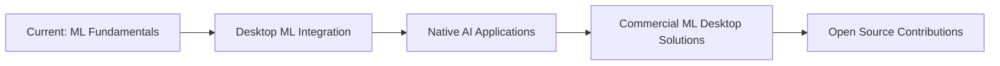

# 👋 Hi there, I'm Mihail Iazinschi!

<div align="center">
  
</div>

## 🎯 About Me

```python
class MihailIazinschi:
    def __init__(self):
        self.university = "University POLITEHNICA of Bucharest"
        self.faculty = "Faculty of Automatic Control and Computers"
        self.current_year = 2
        self.current_passion = "Machine Learning + Desktop Development"
        
    @property
    def commercial_experience(self):
        return {
            "web_development": "Freelance projects with modern stack",
            "desktop_development": "Native applications & GUI solutions",
            "focus": "Building intelligent desktop applications"
        }
    
    @property
    def unique_combination(self):
        return {
            "academic_foundation": ["Low-level programming", "Mathematical methods"],
            "commercial_skills": ["Full-stack development", "Client solutions"],
            "current_interest": "ML algorithms in desktop applications",
            "vision": "AI-powered native software solutions"
        }
    
    def get_current_goal(self):
        return "Developing ML-powered desktop applications that combine performance with intelligence"
```

## 🎓 Academic Background & International Experience

### 📚 University POLITEHNICA of Bucharest
**Faculty of Automatic Control and Computers - 2nd Year**

- **USO** - Operating Systems (Linux fundamentals & system programming)
- **PCLP** - Low-level Programming (C, Assembly x86)
- **MN** - Numerical Methods (MATLAB, numerical algorithms, ML foundations)
- **Statistics** - Statistical Analysis in MATLAB (foundation for Data Science)

### 🌍 International Experience
**Technical University of Munich (HM)**
- **Advanced Networking** - Protocols, network architectures, distributed systems

## 🤖 ML + Desktop Development Stack

<div align="center">

### 🧠 Machine Learning & Data Science


### 🖥️ Desktop Development (ML Integration)


### 🌐 Web Development (Commercial Experience)


### ⚡ Low-Level & Systems


</div>

## 📊 GitHub Statistics

<div align="center">
  
  
</div>

<div align="center">
  
</div>

## 🏆 Featured Projects

<div align="center">

[](https://github.com/mihailiazinschi/pclp2-advanced-algorithms)
[](https://github.com/mihailiazinschi/Browser-Simulation)

</div>

## 🚀 My Vision: ML-Powered Desktop Apps

<div align="center">

### 🎯 Why This Combination?

```cpp
class IntelligentDesktopApp {
private:
    MachineLearningEngine ml_engine;
    NativeGUI user_interface;
    PerformanceOptimizer optimizer;
    
public:
    // Perfect combination: Performance + Intelligence
    void processData() {
        // Native performance for rapid processing
        auto processed_data = optimizer.optimizeProcessing(raw_data);
        
        // ML for intelligent decisions
        auto predictions = ml_engine.predict(processed_data);
        
        // Native GUI for superior experience
        user_interface.displayResults(predictions);
    }
    
    string getAdvantage() {
        return "Native performance + AI intelligence + Superior UX";
    }
};
```

**Advantages of my approach:**
- 🔥 **Native performance** vs slow web applications
- 🧠 **Intelligence** through integrated ML algorithms
- 🛡️ **Security** - data processed locally
- ⚡ **Responsive UI** - no network lag

</div>

## 💼 Commercial Experience & Academic Foundation

<table align="center">
<tr>
<th>🎓 Academic Foundation</th>
<th>💼 Commercial Experience</th>
<th>🚀 Future: ML + Desktop</th>
</tr>
<tr>
<td>

**Mathematics & Algorithms:**
- Numerical Methods (MATLAB)
- Statistics & probabilities
- Assembly & optimization
- Linux Systems (USO)
- Networking (TUM)

</td>
<td>

**Real Development:**
- React.js applications
- Desktop apps (Qt/tkinter)
- Freelance client projects
- Full-stack solutions
- UI/UX implementation

</td>
<td>

**Current Objectives:**
- ML model integration
- Intelligent desktop apps
- Performance optimization
- Native AI solutions
- Cross-platform deployment

</td>
</tr>
</table>

## 🔬 ML + Desktop Projects (In Development)

```python
current_projects = {
    "intelligent_data_analyzer": {
        "tech_stack": ["Python", "Qt", "scikit-learn", "pandas"],
        "description": "Desktop app with ML for automated data analysis",
        "status": "In development"
    },
    
    "predictive_system_monitor": {
        "tech_stack": ["C++", "Qt", "Python ML backend"],
        "description": "System monitor with ML predictions for performance",
        "status": "Planning phase"
    },
    
    "smart_desktop_assistant": {
        "tech_stack": ["Electron", "TensorFlow.js", "Node.js"],
        "description": "Desktop assistant with NLP and automation",
        "status": "Research phase"
    }
}
```

## 📈 Learning Path: Academic → Commercial → ML Integration

<div align="center">
  
</div>

## 🛠️ Skillset Evolution

<div align="center">

### Current Expertise Level


</div>

## 🎯 Roadmap 2025



## 🔧 Development Environment

<div align="center">
  
</div>

### 🧰 ML-Desktop Integration Tools
- **PyQt5/6** - Python ML + Native GUI
- **Qt + Python embedding** - C++ performance + ML models
- **Electron + TensorFlow.js** - Cross-platform ML apps
- **C++ + Python API** - Native performance + ML power

## 🤝 Collaborations & Opportunities

<div align="center">

🚀 **I'm interested in:**
- **ML + Desktop Projects** (open-source or commercial)
- **ML Engineering Internships** with focus on native applications
- **Collaborations** on innovative AI desktop projects
- **Freelance ML Desktop Development**
- **Research projects** in applied ML

[](https://linkedin.com/in/mihail-iazinschi)
[](mailto:mihail.iazinschi@stud.acs.upb.ro)
[](https://github.com/mihailiazinschi)

</div>

---

<div align="center">
  
  
  ### 💡 "The future belongs to applications that think and perform natively."
  
  
</div>

## 🌟 Unique Value Proposition

<div align="center">

**Academic Foundation** + **Commercial Experience** + **ML Passion** = **Next-Gen Desktop Applications**

*Combining the mathematical rigor of academia, the practical experience of freelancing, and the innovation of machine learning to create intelligent, high-performance desktop solutions.*

</div>